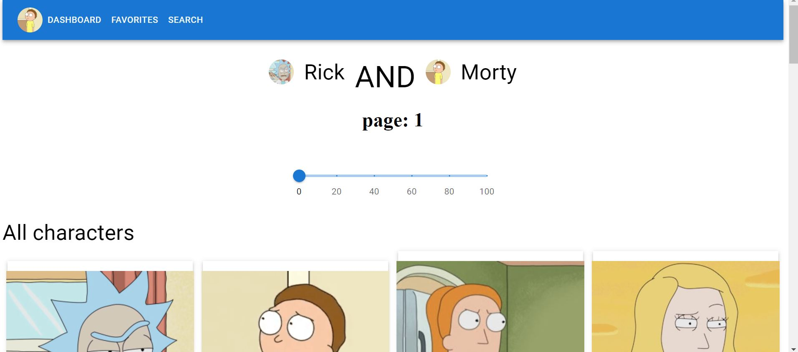
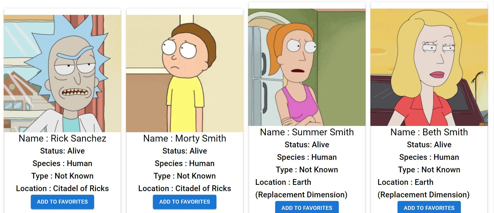
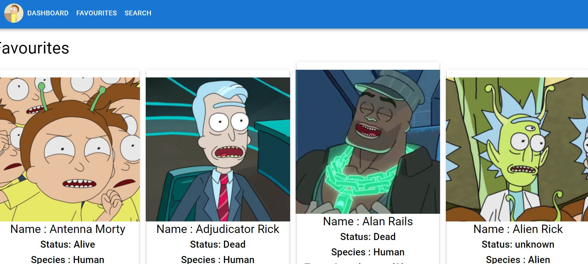
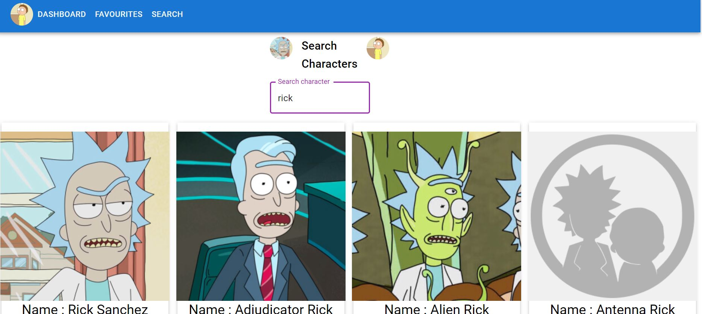

# Rickandmorty 👋  App 

## LIVE : https://rickandmorty-mern.herokuapp.com/


Made with ⚡
 - MERN STACK( MongoDB, Express, React js, Node ) ✅
 - Material UI ✅
 - Rick and Morty api ✅


Functionality 📋
  - Generating all characters with api 🆗
  - Saving the Favourites characters (by saving data in Mongodb database)🆗
  - Used Hooks(useEffect and useState) to show real time change when depending variable changes.🆗
  - Search characters in search page (pagination) 🆗
  - Routing🆗

Preview of the App ✋
<div display="flex">
 </img>
 </img>
 </img>
 </img>
</div>


Will add some more feature 📋
  - User Authentication✅
  - Public and private saved characters✅
  - User disscussion on their faourite characters✅
  - Will integrate the *Harry potter api* and *Breaking Bad api" Later in this project✅


How to run this app :
```
  - git clone *https://github.com/inceptionabhishek/Rickandmorty/*
  - cd Rickandmorty
  - cd client
  - npm i
  - cd..
  - cd server 
  - npm i
  - Make *.env* file and add MONGO_URI=*(url of your mongodb cluster)*
  - npm start
  - cd ..
  - cd client
  - npm start
```
Thanks ..

